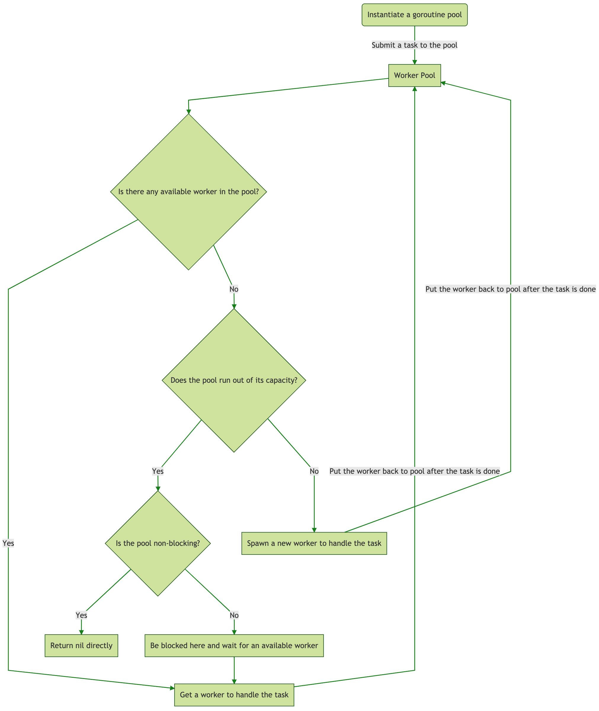
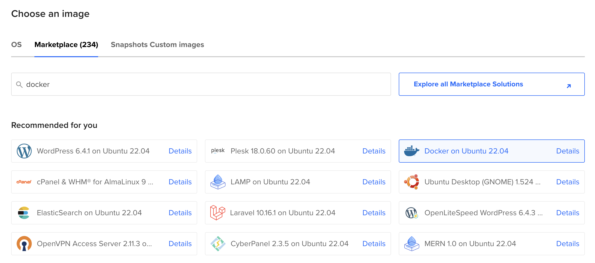
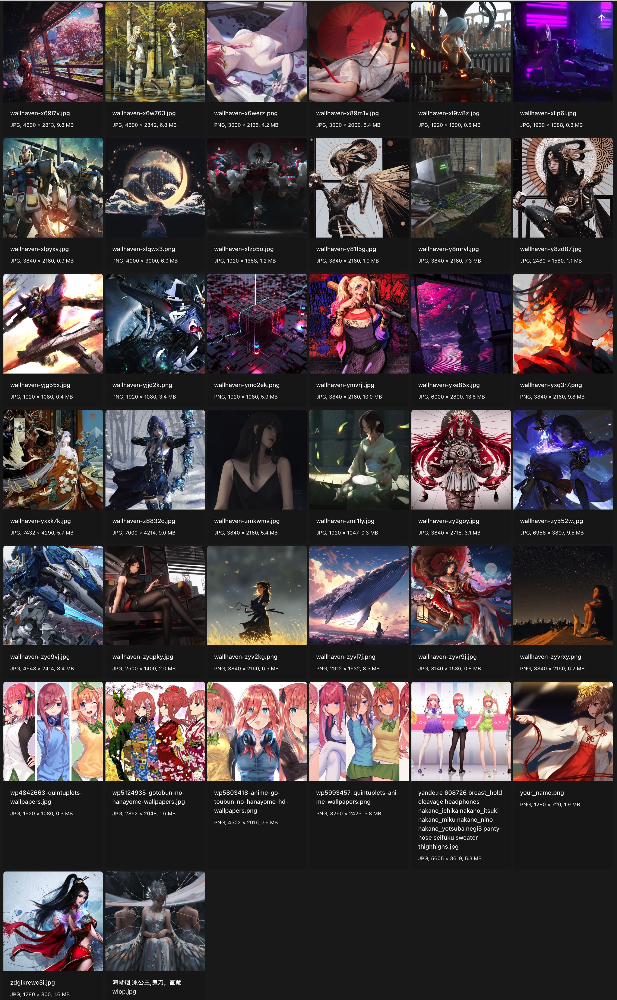
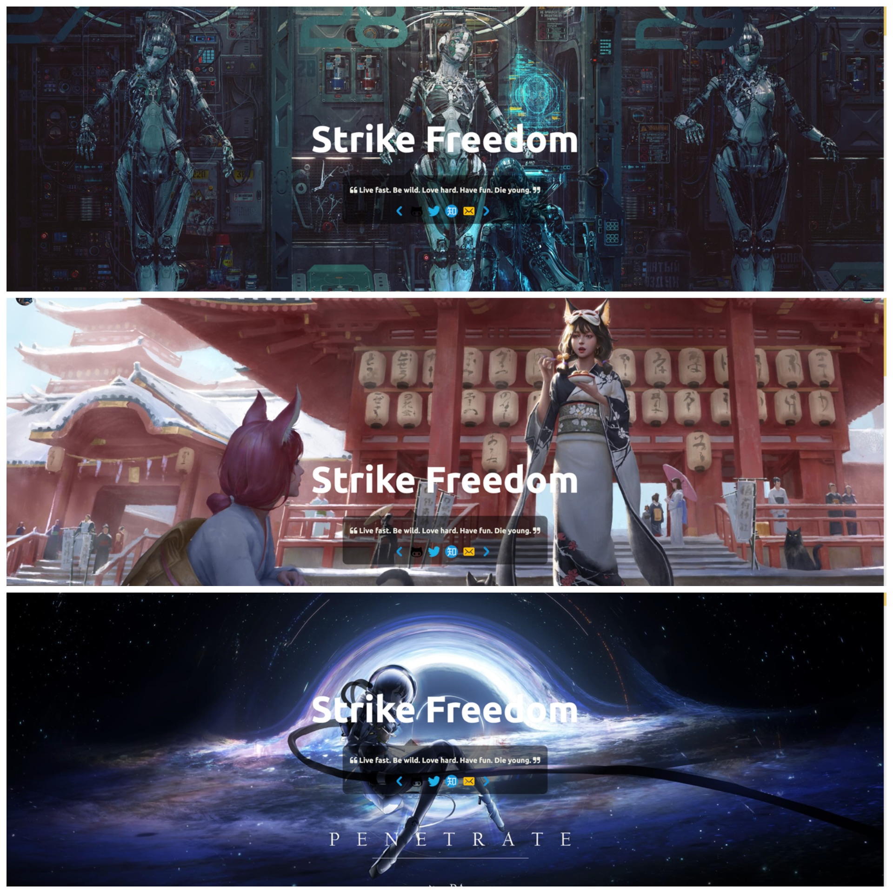
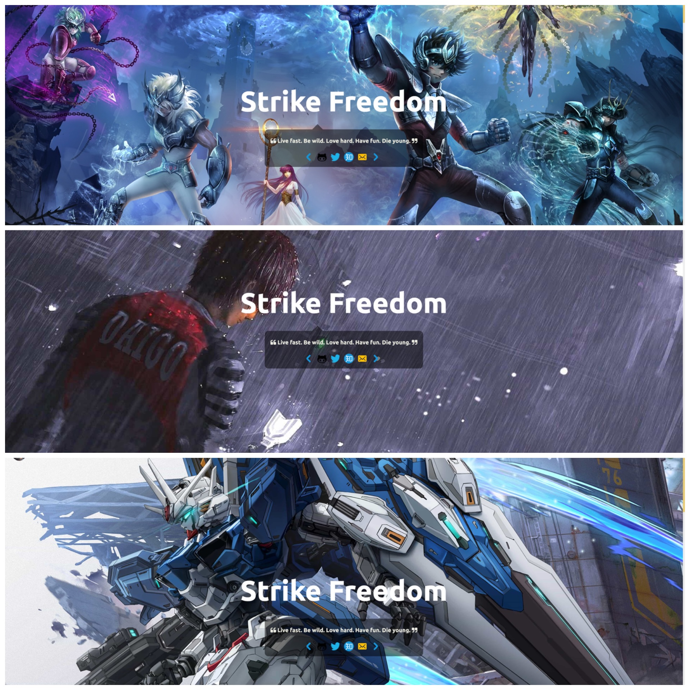

+++
date = 2024-06-30
title = 'Howto deploy services with ants on DigitalOcean'
summary = 'Howto deploy services with ants on DigitalOcean'
layout = 'page'
tags = ['DigitalOcean', 'Open source', 'Docker', 'Tutorial', 'Showcase']
[params]
  author = 'Andy Pan'
showAuthor = true
showDate = true
showReadingTime = true
showWordCount = true

+++

[](https://www.digitalocean.com/?refcode=5d8774f42124&utm_campaign=Referral_Invite&utm_medium=Referral_Program&utm_source=badge)

## External Link

Visit [this](https://strikefreedom.top/archives/howto-deploy-services-with-ants-on-digitalocean).

## Introduction to ants

Library `ants` implements a goroutine pool with fixed capacity, managing and recycling a massive number of goroutines, allowing developers to limit the number of goroutines in your concurrent programs. Services that need to conserve the system resources while handling a mass of requests/tasks can really use some help from `ants`.

This is how `ants` works under the hood:



Visit [this](/projects/ants/) for more details.


## Random image API service

I've created a project `gallery` that responds with random images via HTTP protocol, which makes use of `ants` to process concurrency tasks. In this tutorial, I'll walk you through how to deploy this API service using docker on DigitalOcean's droplet, so that you can use this service everywhere.

### Creating droplet

First of all, let's navigate to the `Droplets` menu on your DigitalOcean console and click on the `Create Droplet` button in the upper right corner.

Secondly, either you switch to the `Marketplace` tab and pick the `Docker on Ubuntu 22.04` when you choose an image to be installed on your droplet or you choose any image you prefer and install the docker engine later by following these [docs](https://docs.docker.com/engine/install/).



Lastly, choose your preferred region, size, and other additional configurations for your droplet before clicking the button `Create Droplet`.

Now that we've created the droplet, you may want to initialize your server with the help of this [official tutorial](https://www.digitalocean.com/community/tutorials/initial-server-setup-with-ubuntu).

### Using Docker

If you make it here, you should be able to use docker on the droplet to pull any images hosted on [Docker Hub](https://hub.docker.com/) and deploy them on your droplet. The Docker Engine normally doesn't come with Docker Compose, so you have to [install it manually](https://docs.docker.com/compose/install/). We're going to deploy the `gallery` service using docker compose with this `docker-compose.yml`:

```yaml
version: "3.8"

services:
  nginx:
    image: nginx:1.27.0-alpine
    container_name: nginx
    restart: always
    networks:
      - gallery_network
    ports:
      - "80:80"
      - "443:443"
    volumes:
      - /etc/nginx:/etc/nginx:ro
      - /usr/share/nginx/html:/usr/share/nginx/html:ro
      - /your/images/location:/your/images/location:ro
      - /var/log/nginx:/var/log/nginx
      - /var/cache/nginx:/var/cache/nginx
  gallery:
    image: panjf2000/gallery:v1.1.0
    container_name: gallery
    restart: on-failure:3
    networks:
      - gallery_network
    ports:
      - "7000:7000"
    volumes:
      # Specify the location where you put the images for displaying via
      # API service.
      - /your/images/location/:/your/images/location/:ro
    environment:
      - PORT=7000
      - DIR=/your/images/location/
      # The actual backend that serves static content.
      - URL=https://api.your-domain.com/images/
      # Set the maximum requests per second per remote IP.
      - RATE_LIMIT_MAX=10
      # Set the expiration time in minutes for the token bucket of
      # the HTTP rate limiter.
      - RATE_LIMIT_TTL=30
      # Set the time window in seconds of caching the response for
      # the requests with the same URI.
      - CACHE_TTL=3
      # Set URL query key for lazy loading.
      - LOADING_KEY=thumb
      # Specify the placeholder image for lazy loading.
      - LOADING_PAGE=wallpaper-loading.gif
      # Determine whether the service should serve content itself
      # or redirect requests to the backend server like nginx.
      - SERVE_CONTENT=false

networks:
  gallery_network:
```

Before v1.1.0 (such as v1.0.0), you must deploy the `gallery` service in conjunction with a static content server, that way the `gallery` service can redirect the requests to the backend that serves static content. There are many open-source reverse proxies that can be used as static content servers, such as [nginx](https://nginx.org/) or [caddy](https://caddyserver.com/). For what it is worth, this [blog post](https://blog.tjll.net/reverse-proxy-hot-dog-eating-contest-caddy-vs-nginx/) may help you decide.

In this tutorial, I'll go with nginx but other reverse proxies should also be as eminent static content servers as nginx. Therefore, just choose whichever reverse proxy you like. Here is a sample configuration of nginx as a static content server:

```nginx
server {

        ...

        location ^~ /your/uri/path/ {
          # gzip_static on;
          # gzip_comp_level 5;

          sendfile on;
          sendfile_max_chunk 1m;

          tcp_nopush on;
          tcp_nodelay on;
          keepalive_timeout 65;

          access_log off;
          expires 7d;
          client_max_body_size 128M;

          valid_referers none blocked server_names
            127.0.0.1
            ~.*google\.
            ~.*baidu\.
            ~.*bing\.
            ~.*yahoo\.
            ~.*your-domain\.com\/?$;

          if ($invalid_referer) {
            return 403;
          }

          root /your/images/location/;
        }
}
```

As of v1.1.0, `gallery` is able to serve content itself by replying to the request with a random image directly. This feature is enabled by default, but you can turn it off by adding the environment variable of `- SERVE_CONTENT=false` to the `dcoker-compse.yml`.

Before we starting to deploy the services, you may want to hand-pick some pictures and stuff them in the location where nginx will serve static content. This directory containing those pictures is monitored by `gallery`, so any updates to the directory will be automatically reloaded inside `gallery`, which means that you can add, delete or modify pictures at any time without worrying about data synchronisation.

After all preliminary procedures are done, we now can deploy the `gallery` service using docker compose: go to wherever the `docker-compose.yml` is located and run the following command:

```bash
docker compose up -d
```

If no errors are reported from running the above command, we then should have had this service up and running.

At this point, an API service should be ready to accept requests. You can configure your DNS to translate your custom domain to the droplet IP along with proxying the requests from nginx to the `gallery` service. The simplest way to manage your DNS records with custom domains for your droplets is to do it on [DigitalOcean](https://docs.digitalocean.com/products/networking/dns/). Or you can just do it using your own DNS provider from which you bought your domains, like [CloudFlare](https://www.cloudflare.com/application-services/products/dns/) or [AWS](https://aws.amazon.com/route53/).

### Usage of gallery

There are a few tips you should know when requesting random images from the `gallery` API service:

1. Append a query parameter `thumb=128` (or whatever you specified for `LOADING_KEY` in `docker-compose.yml`) if you're only getting a placeholder image for lazy loading, the value of the query paramter must be less than or equal to 640. The placeholder image must be placed in the location where your random images are, its name should be specified via `LOADING_PAGE` in `docker-compose.yml`.
2. Generate some random query parameters and append them to the request URL each time if you intend to get different images from each response because the `gallery` service will cache the response for requests with the same URI to make the API idempotent in a given time window (controlled by `CACHE_TTL` in `docker-compose.yml`).
3. You should configure the HTTP rate limiter of the `gallery` service to protect your API service from attackers abusing the API. It enables you to clamp the QPS per remote IP using expirable token buckets. Set `RATE_LIMIT_MAX` and `RATE_LIMIT_TTL` in `docker-compose.yml` properly.

Once you've deployed the `gallery` service, you will be able to use it everywhere to display your photos randomly!

## Showcases






